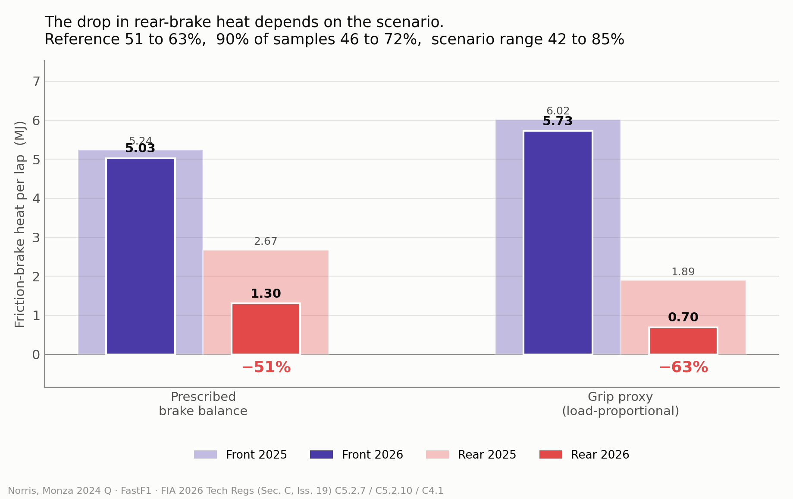
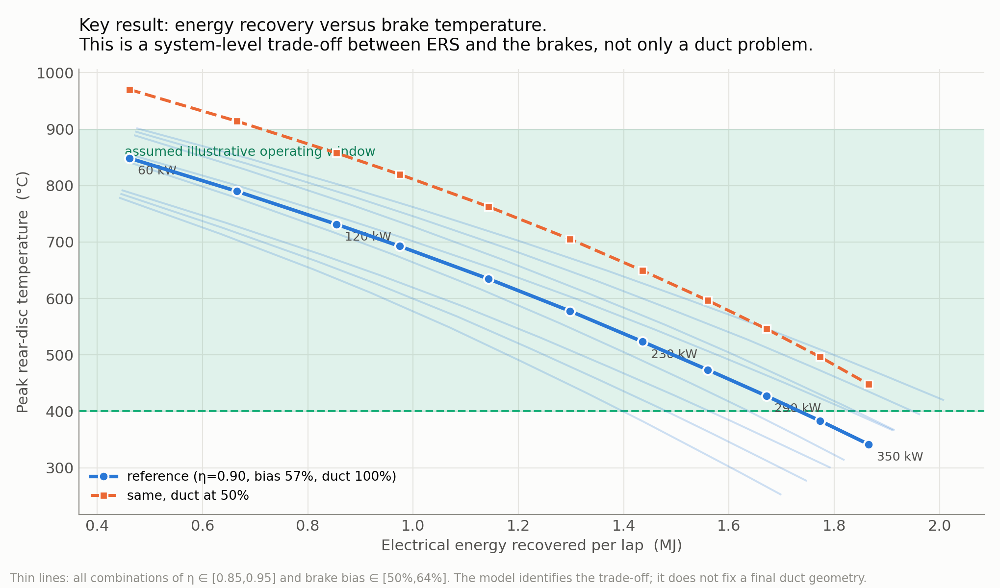
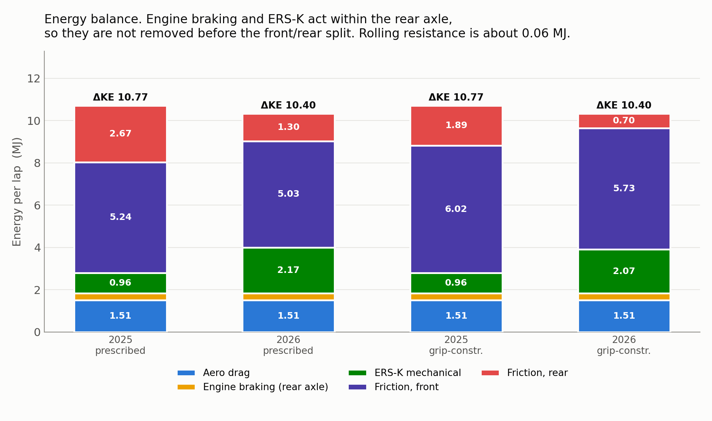
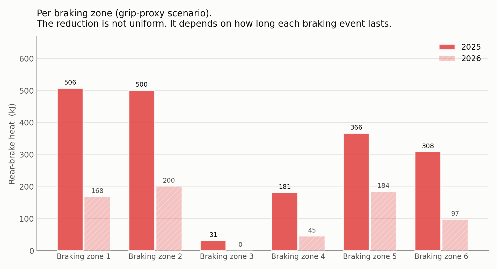
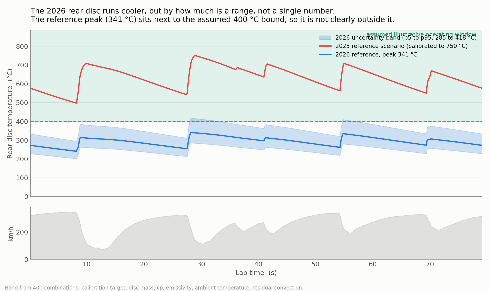
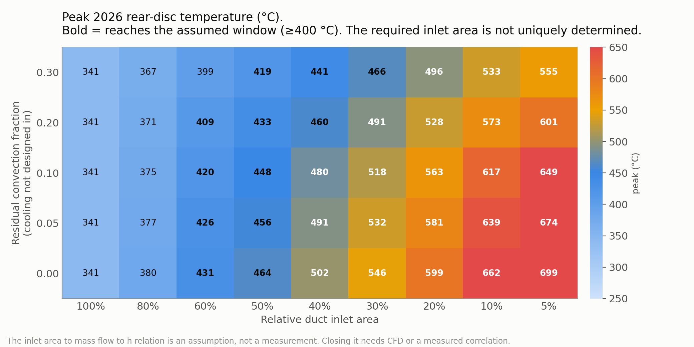
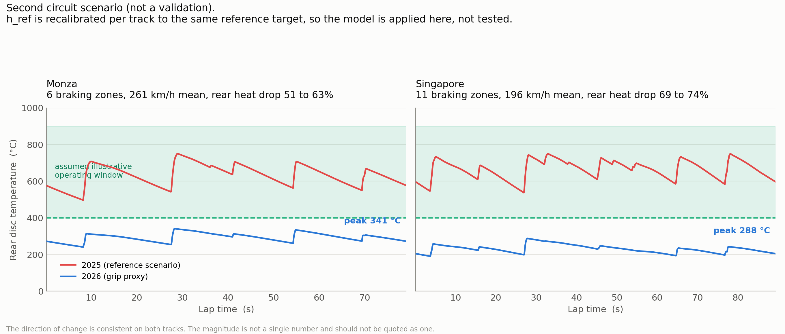
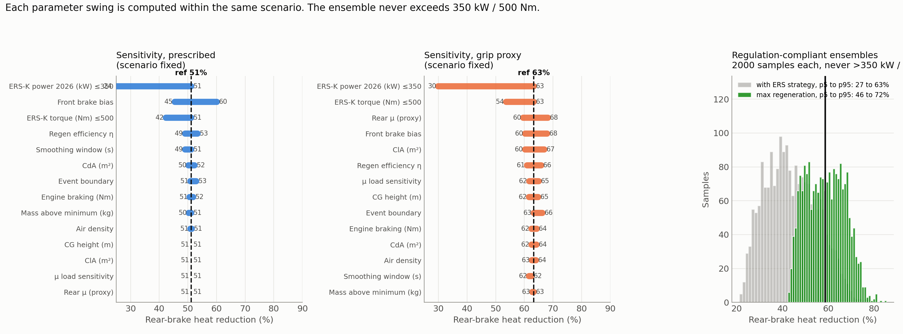
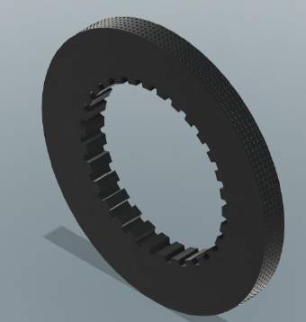
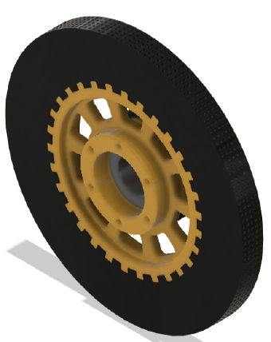

# F1 Rear Brake Energy and Thermal Study, 2026 Regulations

Ioanna Texakalidou, independent project, 2026

In 2026 the MGU-K goes up to 350 kW and harvests on the rear axle. I wanted to know what that does to the rear friction brakes, so I built a Python model from public telemetry (FastF1) and the FIA 2026 Technical Regulations (Section C, Issue 19). I started this project while preparing for McLaren Racing NEXT 2026.

## Results

| | |
|---|---|
| Rear friction brake energy, 2025 to 2026 | 51% lower with a prescribed brake balance, 63% lower with a load proportional grip proxy |
| Monte Carlo, maximum regeneration (2,000 samples, all within 350 kW and 500 Nm) | 46% to 72% lower (p5 to p95) |
| 2026 rear disc peak temperature, energy and thermal uncertainty combined | 303 °C to 499 °C (p5 to p95) |
| Front brakes | almost unchanged |

My conclusion is that rear brake cooling in 2026 can't be solved by sizing the duct on its own. It is a trade-off between how much energy the ERS recovers, how brake-by-wire blends the braking, the brake balance, the thermal capacity of the disc and the cooling airflow.

## How I did it

1. Took a Monza 2024 qualifying lap from FastF1 and found every braking event and the kinetic energy lost in each one.
2. Split that energy between aero drag, rolling resistance, engine braking, the MGU-K and the friction brakes, then divided the friction part between front and rear.
3. Took every ERS limit (power, torque, minimum mass) from a specific article of the 2026 regulations.
4. Modelled the rear disc temperature through the lap with a lumped thermal model (heat input per braking event, convection and radiation), calibrated to a 2025 reference.
5. Ran a sensitivity study for each parameter and Monte Carlo ensembles that only use legal ERS settings.
6. Repeated the analysis for Singapore, which has many more braking zones.

| Energy balance per lap | Per braking zone |
|---|---|
|  |  |

| Disc temperature over one lap | Duct inlet area sweep |
|---|---|
|  |  |

## Rear corner CAD (Fusion 360, in progress)

A parametric model of the rear corner: a 278 mm disc with a drilled friction face and internal drive splines, the splined bell, the caliper, the wheel and tyre, and the upright packaging. It uses the same parameters as the thermal model, so when an assumption changes, the geometry updates.

| Disc | Disc on its bell | Assembled corner |
|---|---|---|
|  |  |  |

## Limitations

I report ranges instead of single numbers because the data doesn't support a single number. I don't have any measured brake temperature, tyre or CFD data, so nothing here is validated. A lumped model also can't tell you the exact duct size you need. That needs CFD or a measured cooling correlation, which is the next step.

## Tools

Python (NumPy, SciPy, pandas, Matplotlib, pytest), FastF1, Fusion 360

The code and data are private. I'm happy to walk through the model on a call.

Contact: j.texakalidou@gmail.com | [Portfolio](https://ioannatexakalidou.github.io)
